# Angle Test

Represent an angle + a quantized vector length as a single byte.

Current function:

```go
func angleLength(input uint8) (uint8, uint8) {
    const twopi = 2 * math.Pi
    const steps = 10
    if input == 0 {
        return 0, 0
    }
    length := (input / steps) * steps
    inputFloat64 := float64(input) / 255.0
    angleByte := uint8(math.Mod(inputFloat64*steps*twopi, twopi) * (255.0 / twopi))
    return angleByte, length
}
```

Input and output values + images:


    input 0 -> angle 0.000000, length 0.000000


    input 1 -> angle 0.039216, length 0.000000


    input 2 -> angle 0.078431, length 0.000000


    input 3 -> angle 0.117647, length 0.000000


    input 4 -> angle 0.156863, length 0.000000


    input 5 -> angle 0.196078, length 0.000000


    input 6 -> angle 0.235294, length 0.000000


    input 7 -> angle 0.274510, length 0.000000


    input 8 -> angle 0.313725, length 0.000000


    input 9 -> angle 0.349020, length 0.000000


    input 10 -> angle 0.392157, length 0.039216


    input 11 -> angle 0.431373, length 0.039216


    input 12 -> angle 0.470588, length 0.039216


    input 13 -> angle 0.505882, length 0.039216


    input 14 -> angle 0.549020, length 0.039216


    input 15 -> angle 0.588235, length 0.039216


    input 16 -> angle 0.627451, length 0.039216


    input 17 -> angle 0.662745, length 0.039216


    input 18 -> angle 0.701961, length 0.039216


    input 19 -> angle 0.745098, length 0.039216


    input 20 -> angle 0.784314, length 0.078431


    input 21 -> angle 0.819608, length 0.078431


    input 22 -> angle 0.862745, length 0.078431


    input 23 -> angle 0.898039, length 0.078431

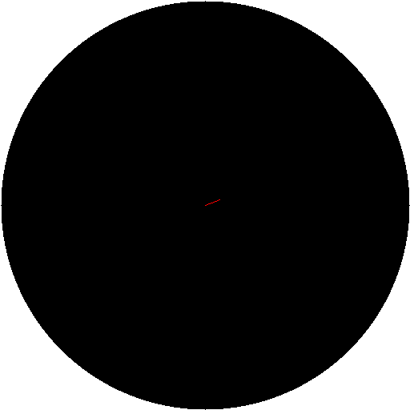

    input 24 -> angle 0.941176, length 0.078431


    input 25 -> angle 0.976471, length 0.078431


    input 26 -> angle 0.015686, length 0.078431

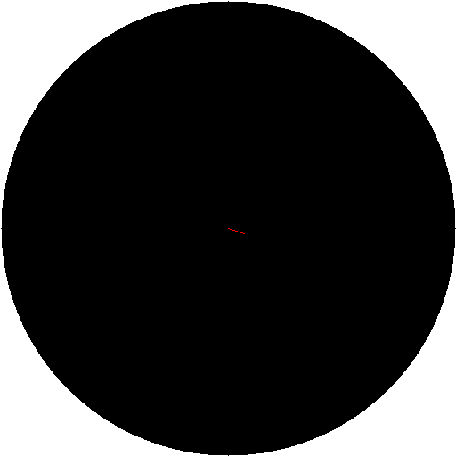

    input 27 -> angle 0.054902, length 0.078431


    input 28 -> angle 0.098039, length 0.078431


    input 29 -> angle 0.133333, length 0.078431


    input 30 -> angle 0.176471, length 0.117647


    input 31 -> angle 0.211765, length 0.117647


    input 32 -> angle 0.250980, length 0.117647


    input 33 -> angle 0.294118, length 0.117647


    input 34 -> angle 0.329412, length 0.117647


    input 35 -> angle 0.372549, length 0.117647


    input 36 -> angle 0.407843, length 0.117647


    input 37 -> angle 0.450980, length 0.117647


    input 38 -> angle 0.490196, length 0.117647


    input 39 -> angle 0.529412, length 0.117647


    input 40 -> angle 0.568627, length 0.156863


    input 41 -> angle 0.603922, length 0.156863


    input 42 -> angle 0.643137, length 0.156863


    input 43 -> angle 0.686275, length 0.156863


    input 44 -> angle 0.725490, length 0.156863


    input 45 -> angle 0.764706, length 0.156863


    input 46 -> angle 0.800000, length 0.156863


    input 47 -> angle 0.843137, length 0.156863


    input 48 -> angle 0.882353, length 0.156863


    input 49 -> angle 0.917647, length 0.156863


    input 50 -> angle 0.956863, length 0.196078


    input 51 -> angle 0.000000, length 0.196078


    input 52 -> angle 0.035294, length 0.196078


    input 53 -> angle 0.078431, length 0.196078


    input 54 -> angle 0.113725, length 0.196078


    input 55 -> angle 0.156863, length 0.196078


    input 56 -> angle 0.196078, length 0.196078


    input 57 -> angle 0.235294, length 0.196078


    input 58 -> angle 0.270588, length 0.196078


    input 59 -> angle 0.313725, length 0.196078


    input 60 -> angle 0.352941, length 0.235294


    input 61 -> angle 0.392157, length 0.235294


    input 62 -> angle 0.427451, length 0.235294


    input 63 -> angle 0.470588, length 0.235294


    input 64 -> angle 0.505882, length 0.235294


    input 65 -> angle 0.545098, length 0.235294


    input 66 -> angle 0.588235, length 0.235294


    input 67 -> angle 0.623529, length 0.235294


    input 68 -> angle 0.662745, length 0.235294


    input 69 -> angle 0.701961, length 0.235294


    input 70 -> angle 0.745098, length 0.274510


    input 71 -> angle 0.784314, length 0.274510


    input 72 -> angle 0.819608, length 0.274510


    input 73 -> angle 0.858824, length 0.274510


    input 74 -> angle 0.901961, length 0.274510


    input 75 -> angle 0.941176, length 0.274510

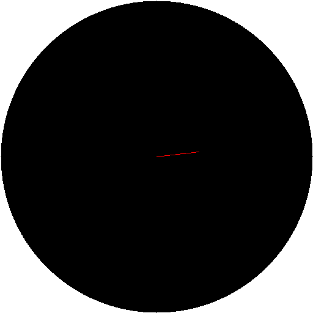

    input 76 -> angle 0.980392, length 0.274510


    input 77 -> angle 0.015686, length 0.274510


    input 78 -> angle 0.058824, length 0.274510


    input 79 -> angle 0.098039, length 0.274510


    input 80 -> angle 0.137255, length 0.313725


    input 81 -> angle 0.176471, length 0.313725


    input 82 -> angle 0.211765, length 0.313725


    input 83 -> angle 0.250980, length 0.313725


    input 84 -> angle 0.290196, length 0.313725


    input 85 -> angle 0.329412, length 0.313725


    input 86 -> angle 0.372549, length 0.313725


    input 87 -> angle 0.411765, length 0.313725


    input 88 -> angle 0.450980, length 0.313725


    input 89 -> angle 0.490196, length 0.313725


    input 90 -> angle 0.529412, length 0.352941


    input 91 -> angle 0.568627, length 0.352941


    input 92 -> angle 0.603922, length 0.352941


    input 93 -> angle 0.643137, length 0.352941


    input 94 -> angle 0.686275, length 0.352941


    input 95 -> angle 0.725490, length 0.352941


    input 96 -> angle 0.764706, length 0.352941


    input 97 -> angle 0.800000, length 0.352941


    input 98 -> angle 0.839216, length 0.352941


    input 99 -> angle 0.878431, length 0.352941


    input 100 -> angle 0.917647, length 0.392157


    input 101 -> angle 0.956863, length 0.392157


    input 102 -> angle 0.000000, length 0.392157


    input 103 -> angle 0.035294, length 0.392157


    input 104 -> angle 0.074510, length 0.392157


    input 105 -> angle 0.113725, length 0.392157


    input 106 -> angle 0.156863, length 0.392157


    input 107 -> angle 0.196078, length 0.392157


    input 108 -> angle 0.231373, length 0.392157


    input 109 -> angle 0.270588, length 0.392157


    input 110 -> angle 0.313725, length 0.431373


    input 111 -> angle 0.352941, length 0.431373


    input 112 -> angle 0.392157, length 0.431373


    input 113 -> angle 0.431373, length 0.431373


    input 114 -> angle 0.470588, length 0.431373


    input 115 -> angle 0.505882, length 0.431373


    input 116 -> angle 0.545098, length 0.431373


    input 117 -> angle 0.584314, length 0.431373


    input 118 -> angle 0.627451, length 0.431373


    input 119 -> angle 0.666667, length 0.431373


    input 120 -> angle 0.705882, length 0.470588


    input 121 -> angle 0.745098, length 0.470588

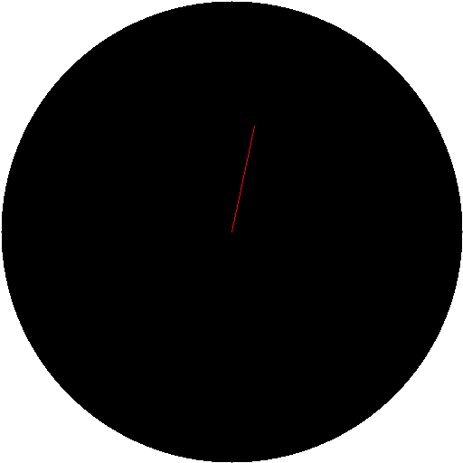

    input 122 -> angle 0.784314, length 0.470588


    input 123 -> angle 0.819608, length 0.470588


    input 124 -> angle 0.858824, length 0.470588


    input 125 -> angle 0.898039, length 0.470588


    input 126 -> angle 0.941176, length 0.470588


    input 127 -> angle 0.980392, length 0.470588


    input 128 -> angle 0.015686, length 0.470588


    input 129 -> angle 0.054902, length 0.470588


    input 130 -> angle 0.094118, length 0.509804


    input 131 -> angle 0.133333, length 0.509804


    input 132 -> angle 0.176471, length 0.509804


    input 133 -> angle 0.211765, length 0.509804


    input 134 -> angle 0.250980, length 0.509804

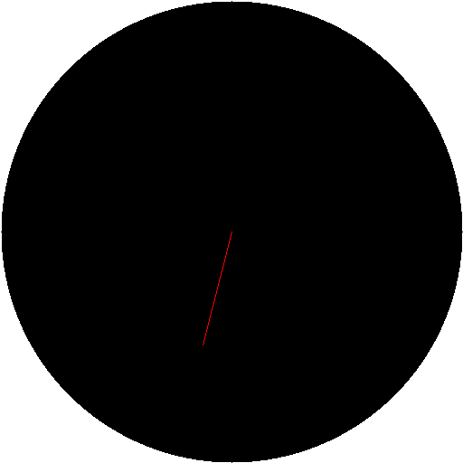

    input 135 -> angle 0.290196, length 0.509804


    input 136 -> angle 0.329412, length 0.509804


    input 137 -> angle 0.368627, length 0.509804


    input 138 -> angle 0.407843, length 0.509804


    input 139 -> angle 0.447059, length 0.509804


    input 140 -> angle 0.490196, length 0.549020


    input 141 -> angle 0.529412, length 0.549020


    input 142 -> angle 0.568627, length 0.549020


    input 143 -> angle 0.603922, length 0.549020


    input 144 -> angle 0.643137, length 0.549020


    input 145 -> angle 0.682353, length 0.549020


    input 146 -> angle 0.721569, length 0.549020


    input 147 -> angle 0.760784, length 0.549020

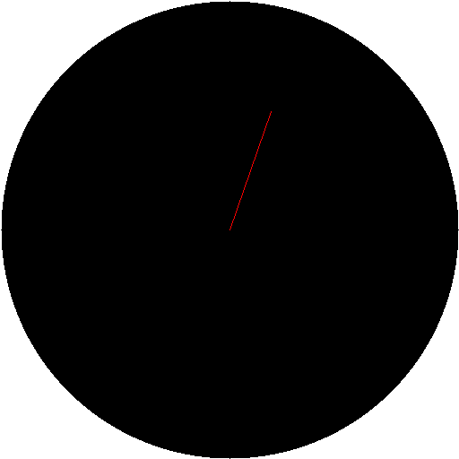

    input 148 -> angle 0.803922, length 0.549020


    input 149 -> angle 0.843137, length 0.549020


    input 150 -> angle 0.882353, length 0.588235


    input 151 -> angle 0.921569, length 0.588235


    input 152 -> angle 0.960784, length 0.588235


    input 153 -> angle 0.000000, length 0.588235


    input 154 -> angle 0.035294, length 0.588235


    input 155 -> angle 0.074510, length 0.588235


    input 156 -> angle 0.117647, length 0.588235


    input 157 -> angle 0.156863, length 0.588235


    input 158 -> angle 0.196078, length 0.588235


    input 159 -> angle 0.235294, length 0.588235


    input 160 -> angle 0.274510, length 0.627451


    input 161 -> angle 0.313725, length 0.627451


    input 162 -> angle 0.352941, length 0.627451


    input 163 -> angle 0.392157, length 0.627451


    input 164 -> angle 0.427451, length 0.627451


    input 165 -> angle 0.466667, length 0.627451


    input 166 -> angle 0.505882, length 0.627451


    input 167 -> angle 0.545098, length 0.627451


    input 168 -> angle 0.584314, length 0.627451


    input 169 -> angle 0.623529, length 0.627451


    input 170 -> angle 0.662745, length 0.666667


    input 171 -> angle 0.701961, length 0.666667


    input 172 -> angle 0.745098, length 0.666667


    input 173 -> angle 0.784314, length 0.666667


    input 174 -> angle 0.823529, length 0.666667


    input 175 -> angle 0.862745, length 0.666667


    input 176 -> angle 0.901961, length 0.666667


    input 177 -> angle 0.941176, length 0.666667


    input 178 -> angle 0.980392, length 0.666667


    input 179 -> angle 0.015686, length 0.666667


    input 180 -> angle 0.058824, length 0.705882


    input 181 -> angle 0.098039, length 0.705882


    input 182 -> angle 0.137255, length 0.705882


    input 183 -> angle 0.176471, length 0.705882


    input 184 -> angle 0.211765, length 0.705882


    input 185 -> angle 0.250980, length 0.705882


    input 186 -> angle 0.290196, length 0.705882


    input 187 -> angle 0.329412, length 0.705882


    input 188 -> angle 0.372549, length 0.705882


    input 189 -> angle 0.411765, length 0.705882


    input 190 -> angle 0.450980, length 0.745098


    input 191 -> angle 0.490196, length 0.745098


    input 192 -> angle 0.529412, length 0.745098

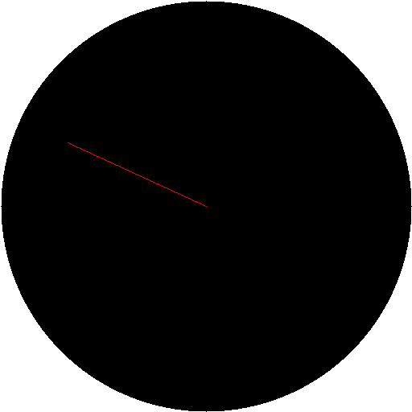

    input 193 -> angle 0.568627, length 0.745098


    input 194 -> angle 0.603922, length 0.745098


    input 195 -> angle 0.643137, length 0.745098


    input 196 -> angle 0.682353, length 0.745098


    input 197 -> angle 0.721569, length 0.745098


    input 198 -> angle 0.760784, length 0.745098


    input 199 -> angle 0.800000, length 0.745098


    input 200 -> angle 0.839216, length 0.784314


    input 201 -> angle 0.878431, length 0.784314


    input 202 -> angle 0.917647, length 0.784314


    input 203 -> angle 0.956863, length 0.784314


    input 204 -> angle 0.000000, length 0.784314


    input 205 -> angle 0.035294, length 0.784314


    input 206 -> angle 0.074510, length 0.784314


    input 207 -> angle 0.113725, length 0.784314


    input 208 -> angle 0.152941, length 0.784314


    input 209 -> angle 0.192157, length 0.784314


    input 210 -> angle 0.231373, length 0.823529


    input 211 -> angle 0.270588, length 0.823529

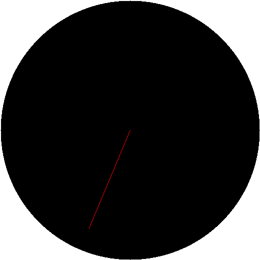

    input 212 -> angle 0.313725, length 0.823529


    input 213 -> angle 0.352941, length 0.823529


    input 214 -> angle 0.392157, length 0.823529


    input 215 -> angle 0.427451, length 0.823529

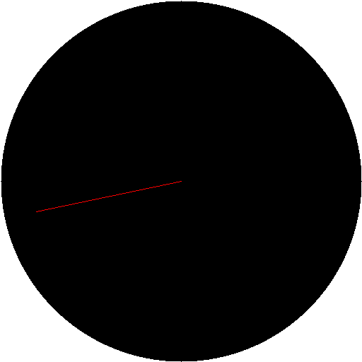

    input 216 -> angle 0.466667, length 0.823529


    input 217 -> angle 0.505882, length 0.823529


    input 218 -> angle 0.545098, length 0.823529


    input 219 -> angle 0.584314, length 0.823529


    input 220 -> angle 0.627451, length 0.862745

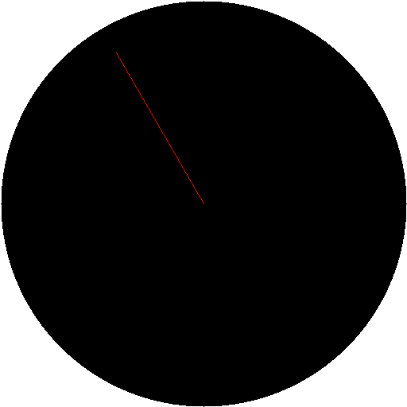

    input 221 -> angle 0.666667, length 0.862745


    input 222 -> angle 0.705882, length 0.862745


    input 223 -> angle 0.745098, length 0.862745


    input 224 -> angle 0.784314, length 0.862745

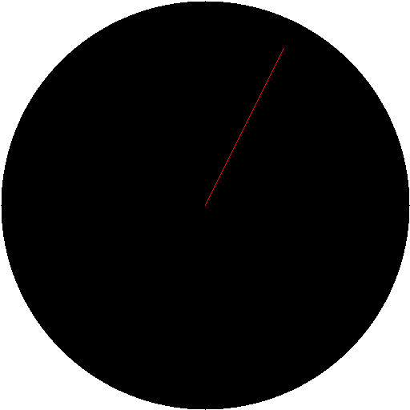

    input 225 -> angle 0.823529, length 0.862745


    input 226 -> angle 0.862745, length 0.862745


    input 227 -> angle 0.901961, length 0.862745


    input 228 -> angle 0.941176, length 0.862745


    input 229 -> angle 0.980392, length 0.862745


    input 230 -> angle 0.015686, length 0.901961


    input 231 -> angle 0.054902, length 0.901961


    input 232 -> angle 0.094118, length 0.901961


    input 233 -> angle 0.133333, length 0.901961


    input 234 -> angle 0.172549, length 0.901961


    input 235 -> angle 0.211765, length 0.901961


    input 236 -> angle 0.254902, length 0.901961


    input 237 -> angle 0.294118, length 0.901961


    input 238 -> angle 0.333333, length 0.901961


    input 239 -> angle 0.372549, length 0.901961


    input 240 -> angle 0.411765, length 0.941176

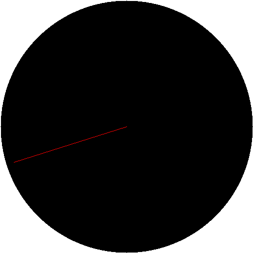

    input 241 -> angle 0.450980, length 0.941176


    input 242 -> angle 0.490196, length 0.941176


    input 243 -> angle 0.529412, length 0.941176


    input 244 -> angle 0.568627, length 0.941176


    input 245 -> angle 0.603922, length 0.941176

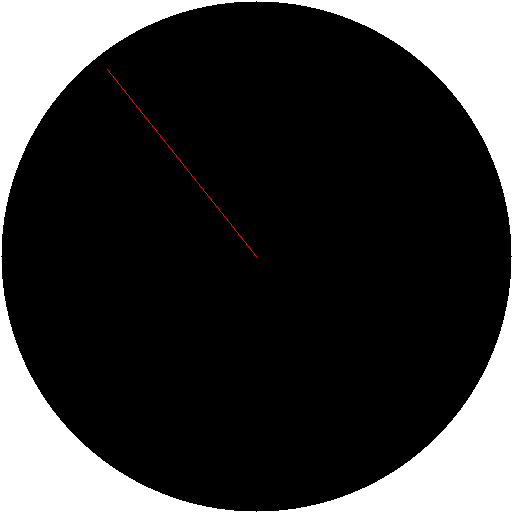

    input 246 -> angle 0.643137, length 0.941176


    input 247 -> angle 0.682353, length 0.941176


    input 248 -> angle 0.721569, length 0.941176

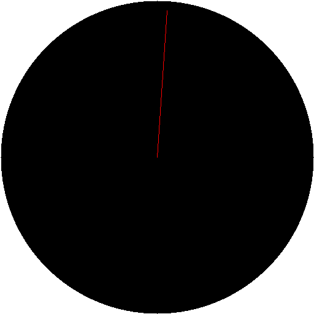

    input 249 -> angle 0.760784, length 0.941176


    input 250 -> angle 0.800000, length 0.980392


    input 251 -> angle 0.839216, length 0.980392


    input 252 -> angle 0.882353, length 0.980392


    input 253 -> angle 0.921569, length 0.980392


    input 254 -> angle 0.960784, length 0.980392


    input 255 -> angle 0.000000, length 0.980392
